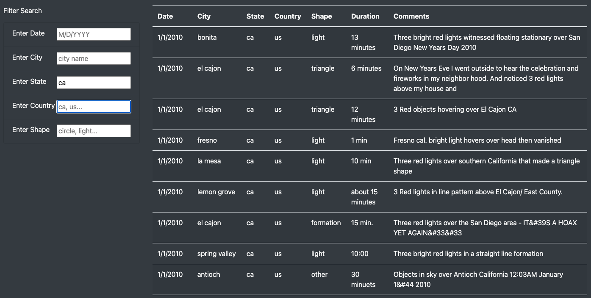
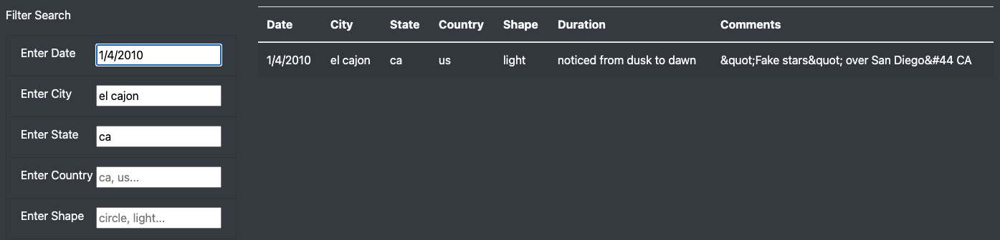

# UFO Sightings
Displaying and filtering UFO sightings data with javascript, Bootstrap, and DOM manipulation.

## Overview
The focus of this project was to build a visually appealing web page featuring dynamically filtered tabular data in a user-friendly interface. The tools used included HTML, Bootstrap, Javascript, and DOM manipulation. The framework for the project was to feature feature a searchable table of UFO sightings data.

## Results

This website is designed to be fairly easy to use. The displayed results are dynamically filtered as you update the form field entries -- no need for a **Submit** or **Refresh** button.

Filter selection can be broad, such as just selecting a state.

Filter selection can also be narrowed down with the inclusion of additional filter criteria, such as Date and City names.

## Summary
This new web page design, including additional search fields, is a definite improvement over the previous iteration. The previous version only provided a date field to search by and depended upon a button click to refresh or update the displayed table. However, there are still a couple of problems with the use of these form fields with this starting table data.
- The filter method in the backend is case-sensitive in its matches. Fortunately all the data in the table is in lower case (except for **Comments**), but typing in the **City** of `San Pablo` will not return results for `san pablo`, and `TX` in the **State** field will not return results for `tx`.
- Without knowing exactly what the existing options are for the **Shape** field, it's hard to effectively search using that filter. There seem to be a limited number of pre-defined descriptions, but if I search for something using terms such as `oblong` or `ovoid` I receive no results. I would need to know what my options are for this field.
Which brings me to improvement suggestions...
- The **Shape** form field should instead be a drop-down selection menu, listing all the available description options.
- The **Date** field should be a date selector field. Also, in order for this to work properly, the values in the **Date** column would need to be converted to `datetime` objects.
- Lastly, the text in the **Comments** section needs to be cleaned up. There are strange encoding artifacts in there which are visually unappealing.